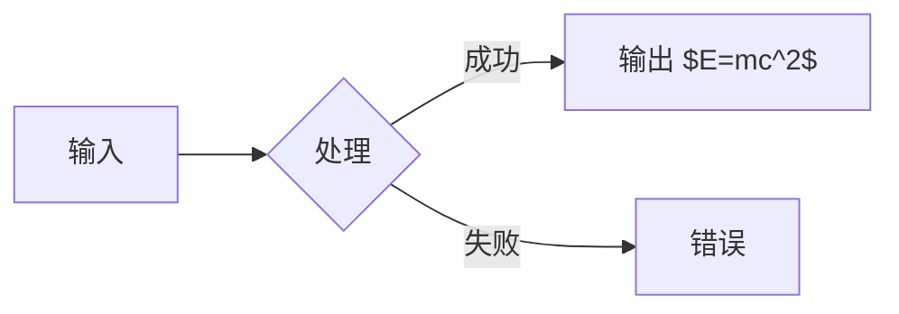

# 数学公式渲染测试 / Math Rendering Test

本文件用于验证 KaTeX 集成是否正常。打开方式：用浏览器打开 `code.html`，拖入本文件。

## 1. 行内公式 / Inline Math

质能方程 $E = mc^2$ 是最著名的物理公式。

欧拉公式 $e^{i\pi} + 1 = 0$ 把五个基本常数联系在一起。

反斜杠分隔符形式：\(\alpha + \beta = \beta + \alpha\)。

## 2. 块级公式 / Display Math

高斯积分：

$$
\int_{-\infty}^{\infty} e^{-x^2} \, dx = \sqrt{\pi}
$$

求和与矩阵（`\[...\]` 形式）：

\[
\sum_{i=1}^{n} i = \frac{n(n+1)}{2}
\]

矩阵：

$$
A = \begin{bmatrix} a_{11} & a_{12} \\ a_{21} & a_{22} \end{bmatrix}
$$

## 3. 代码块保护测试 / Code Block Protection

下面代码块中的 `$` 不应被渲染为公式：

```bash
# 这里的 $VAR 是 shell 变量，不是公式
echo "Price: $5.00"
git commit -m "cost: \$100"
```

行内代码同样不应触发：`$not-math$` 和 `price = $10`。

## 4. 错误容错测试 / Error Tolerance

下面是一个语法错误的公式，应显示错误提示而非崩溃整个页面：

$$\frac{1}{0} \sum_{ \text{未闭合$$

这行文字应该**正常显示**，说明上面的错误没有影响后续渲染。

## 5. 与 Mermaid 共存 / Coexistence with Mermaid

下面是一个 Mermaid 图表，渲染后不应影响其后的公式：



图表之后的公式 $f(x) = x^2$ 应当正常渲染。
